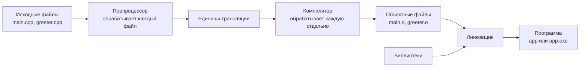

# Путь от исходного кода до программы

Если вы уже писали на C, общая схема будет знакома: исходный код нельзя исполнить напрямую, сначала его нужно скомпилировать. В C++ этапы остаются теми же, но исходные файлы имеют расширение `.cpp`, а программа может использовать возможности языка и стандартной библиотеки C++.

Файл `main.cpp` — это текст. Процессор не понимает конструкции `#include`, `std::cout` и `main`, поэтому перед запуском этот текст нужно превратить в машинные инструкции.



В этой схеме важны два правила:

1. каждый `.cpp` вместе с подключёнными заголовками отдельно превращается в свой объектный файл;
2. только после этого линковщик объединяет объектные файлы и библиотеки в программу.

## Препроцессор и заголовочные файлы

Сначала препроцессор обрабатывает директивы, которые начинаются с `#`. Директива `#include` подставляет содержимое указанного заголовочного файла. Получившийся текст называется **единицей трансляции**.

В программе из одного `.cpp` собственный заголовочный файл обычно не нужен. Он становится полезен, когда код разделён между несколькими `.cpp`.

Допустим, функция реализована в `greeter.cpp`, а вызывается из `main.cpp`. Компилятор будет обрабатывать эти файлы отдельно, поэтому при чтении `main.cpp` ему нужно заранее знать имя функции, тип результата и параметры. Эта информация называется **объявлением**.

Объявление помещаем в `greeter.h`:

```cpp
#pragma once

#include <string>

std::string getGreeting();
```

Оба исходных файла подключают этот заголовок:

```cpp
// main.cpp
#include "greeter.h"

int main()
{
    getGreeting();
}

// greeter.cpp
#include "greeter.h"

std::string getGreeting()
{
    return "Hello!";
}
```

Строка `std::string getGreeting();` — это объявление. Она описывает функцию, но не содержит её тела. Функция с телом в `greeter.cpp` — это **определение**, или реализация.

Объявление хранится в одном заголовке. Если изменятся параметры или тип результата функции, не придётся вручную исправлять его копию в каждом `.cpp`. Подключение заголовка в `greeter.cpp` также позволяет компилятору проверить, что объявление и определение совпадают.

`#include <string>` нужен самому заголовку, потому что в объявлении используется тип `std::string`. В угловых скобках обычно указывают заголовки стандартной библиотеки, а в кавычках — заголовки своего проекта.

`#pragma once` защищает заголовок от повторной обработки, если он был подключён несколько раз.

Заголовочный файл не компилируется отдельно и не создаёт собственный объектный файл. После работы препроцессора компилятор получает две независимые единицы трансляции:

```text
main.cpp + содержимое greeter.h    → единица трансляции main.cpp
greeter.cpp + содержимое greeter.h → единица трансляции greeter.cpp
```

## Из единицы трансляции в объектный файл

Компилятор проверяет каждую единицу трансляции отдельно и создаёт объектный файл:

- в Windows — обычно `.obj`;
- в macOS и Linux — `.o`.

Для нашего примера получится два файла:

```text
main.cpp    → main.obj    или main.o
greeter.cpp → greeter.obj или greeter.o
```

Компилятор не видит весь проект сразу. Во время обработки `main.cpp` он не заглядывает в `greeter.cpp`.

Объектный файл содержит:

- машинные инструкции, полученные из одного `.cpp`;
- сведения о функциях и данных, определённых в этом файле;
- ссылки на функции и данные, реализация которых должна найтись в другом месте.

Имена таких функций и данных называются **символами**. В нашем примере `main.o` хранит ссылку на символ `getGreeting`, а `greeter.o` — машинный код и определение этого символа.

Объектный файл нельзя запустить. Это только часть будущей программы: некоторые ссылки ещё не разрешены, а сами части ещё не объединены в исполняемый файл.

На курсе используются разные компиляторы:

- в Windows — MSVC;
- в macOS — Apple Clang.

## Из объектных файлов в программу

Сам заголовочный файл линковщику не передаётся. В линковке он участвует только косвенно — через информацию, попавшую в объектные файлы:

```text
greeter.h с объявлением
        ↓ #include
main.cpp → main.o: «мне нужна функция getGreeting»

greeter.cpp → greeter.o: «здесь определена функция getGreeting»

main.o + greeter.o → линковщик → программа
```

Объявление из `greeter.h` позволило скомпилировать `main.cpp`. Теперь **линковщик** получает объектные файлы, находит реализацию `getGreeting` в `greeter.o` и связывает её с вызовом из `main.o`.

Если заголовок подключён, но `greeter.cpp` не был скомпилирован и `greeter.o` не попал в сборку, компиляция `main.cpp` завершится успешно, а линковка — ошибкой.

Кроме объектных файлов проекта, линковщик может получать библиотеки с готовым кодом. Например, реализация операций для `std::cout` находится в стандартной библиотеке C++.

В Windows исполняемый файл обычно имеет расширение `.exe`, например `app.exe`. В macOS расширения обычно нет — файл будет называться `app`.

Если нужной реализации нет ни в одном объектном файле или библиотеке, в macOS в сообщении часто встречается `undefined symbol`, а в Windows — `unresolved external symbol`.

Ошибка возникает и в обратной ситуации: если одна функция определена сразу в нескольких объектных файлах, линковщик не сможет выбрать реализацию. Тогда в сообщении появится `duplicate symbol` или `already defined`.

## Что такое статическая библиотека

Линковщику необязательно передавать каждый объектный файл по отдельности. Связанные объектные файлы можно заранее объединить в **статическую библиотеку**.

Статическая библиотека — это архив из одного или нескольких объектных файлов. Например, код из `greeter.cpp` может пройти такой путь:

```text
greeter.cpp → greeter.o → статическая библиотека greeter
```

Имя библиотечного файла зависит от системы:

- в Windows — обычно `greeter.lib`;
- в macOS — обычно `libgreeter.a`.

Статическую библиотеку нельзя запустить: это архив объектных файлов, а не исполняемый файл. Ей не нужна функция `main`. Библиотеку подключают к программе во время линковки:

```text
main.o + библиотека greeter → app
```

Во время линковки нужный код из статической библиотеки становится частью готовой программы. Поэтому отдельный файл этой библиотеки не требуется для запуска `app`.

Если изменить `greeter.cpp`, придётся заново:

1. скомпилировать `greeter.cpp`;
2. пересобрать статическую библиотеку;
3. слинковать программу с новой версией библиотеки.

Статические библиотеки помогают объединять связанный код в самостоятельные части и использовать одну часть в нескольких программах. Позже мы опишем такую библиотеку в CMake отдельно от программы.

> Ошибка компиляции означает, что не удалось создать объектный файл. Ошибка линковки означает, что объектные файлы созданы, но соединить их в программу не получилось.

Далее: [зачем нужны системы сборки и CMake](02-build-systems-and-cmake.md).
