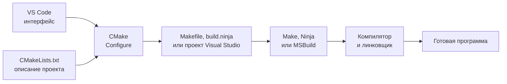

# Системы сборки и CMake

## Зачем нужна система сборки

Продолжим пример с программой из `main.cpp` и `greeter.cpp`. Если изменить только `greeter.cpp`, достаточно заново получить `greeter.o` или `greeter.obj`, а затем повторить линковку. `main.cpp` компилировать ещё раз не нужно. Это называется **инкрементальной сборкой**.

Система сборки хранит информацию о файлах проекта и решает, какие действия нужно повторить после изменений.

Одна из таких систем — Make. Она читает правила из файла `Makefile`. Ниже показан фрагмент Makefile для macOS:

```makefile
greeter.o: greeter.cpp greeter.h
	clang++ -std=c++20 -c greeter.cpp -o greeter.o
```

Слева от `:` записан результат правила, справа — файлы, от которых он зависит. Строка с отступом содержит команду сборки. Make сравнивает время изменения файлов: если `greeter.cpp` или `greeter.h` новее `greeter.o`, команда выполняется снова.

Make используется и сегодня. Проблема не в том, что он устарел. Но в написанном вручную Makefile приходится самостоятельно перечислять команды, зависимости и флаги компилятора. Например, показанная команда с `clang++` подходит для macOS, а для MSVC в Windows будет выглядеть иначе.

## Что добавляет CMake

CMake позволяет описать проект на более высоком уровне: какую программу или библиотеку нужно получить, из каких файлов она состоит и какие возможности C++ ей нужны. Это описание хранится в `CMakeLists.txt`.

Один и тот же `CMakeLists.txt` можно использовать в разных системах. CMake подготовит Makefile для Make, файл `build.ninja` для Ninja или проект Visual Studio для MSBuild.

CMake не является компилятором и не выполняет низкоуровневую сборку вместо Make, Ninja или MSBuild. Он создаёт для выбранной системы сборки необходимые файлы:



В интерфейсе VS Code это выглядит как два разных действия:

- **Configure (подготовка)**: CMake читает `CMakeLists.txt`, проверяет окружение и создаёт файлы для выбранной системы сборки;
- **Build (сборка)**: Make, Ninja или MSBuild запускает компилятор и линковщик.

Способ создания файлов сборки называется **генератором CMake**. Например, генератор `Unix Makefiles` создаёт Makefile, `Ninja` — файл `build.ninja`, а генератор Visual Studio — проект для MSBuild.

Генератор можно закрепить в настройках проекта. В проектах первого занятия он намеренно не закреплён, поэтому выбор передан CMake. Обычно CMake выбирает:

- в Windows — Visual Studio и MSBuild;
- в macOS — `Unix Makefiles` и Make.

Выбранный генератор сохраняется в каталоге `build`. Следующие сборки используют тот же вариант. Чтобы поменять генератор, нужно очистить каталог сборки и снова выполнить Configure. `CMakeLists.txt` и исходный код при этом менять не требуется.

## Главное

1. Каждый `.cpp` отдельно превращается в объектный файл.
2. Линковщик соединяет объектные файлы в программу.
3. Система сборки повторяет только необходимые действия.
4. CMake создаёт файлы для Make, Ninja или MSBuild.
5. VS Code даёт интерфейс для подготовки, сборки и запуска программы.

Далее: [цели и основные команды CMake](03-cmake-targets.md).

Дополнительные материалы: [официальный учебник CMake](https://cmake.org/cmake/help/latest/guide/tutorial/index.html), [генераторы CMake](https://cmake.org/cmake/help/latest/manual/cmake-generators.7.html) и [C++ в Visual Studio Code](https://code.visualstudio.com/docs/languages/cpp).
