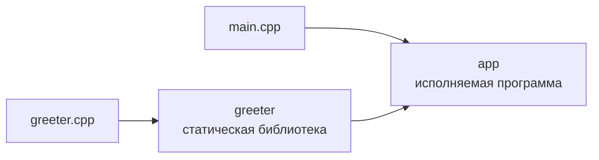

# Цели и основные команды CMake

CMake описывает проект как набор **целей** и связей между ними. Для небольшой программы достаточно одной цели. Когда проект растёт, отдельные части кода удобно оформлять как самостоятельные библиотечные цели.

Цель, или **target**, — это именованный элемент проекта. Обычно цель описывает результат сборки: программу или библиотеку. У неё есть исходные файлы, настройки компиляции и зависимости от других целей.

Например, проект может состоять из программы `app` и библиотеки `greeter`:



CMake видит зависимость и гарантирует, что библиотека будет готова к моменту линковки программы. Независимые исходные файлы при этом могут компилироваться параллельно.

## Исполняемые программы и библиотеки

Исполняемая цель создаётся командой `add_executable`:

```cmake
add_executable(app main.cpp)
```

В её исходниках обычно находится функция `main`. Результат можно запустить: в Windows получится `app.exe`, в macOS — `app`.

Библиотечная цель создаётся командой `add_library`:

```cmake
add_library(greeter STATIC greeter.cpp greeter.h)
```

Библиотеку не запускают отдельно: у неё нет собственной точки запуска. Она содержит код, который используется другими целями.

На начальном этапе достаточно различать два вида библиотек:

- `STATIC` — статическая библиотека; нужный код включается в программу во время линковки;
- `SHARED` — динамическая библиотека; программа загружает её из отдельного файла во время запуска.

Статическая библиотека обычно имеет расширение `.lib` в Windows и `.a` в macOS. Для динамической библиотеки используются `.dll` в Windows и `.dylib` в macOS.

## Как связать две цели

Допустим, файлы проекта расположены так:

```text
example/
├── CMakeLists.txt
├── main.cpp
└── greeter/
    ├── CMakeLists.txt
    ├── greeter.cpp
    └── greeter.h
```

Корневой `CMakeLists.txt` описывает программу и подключает каталог с библиотекой:

```cmake
cmake_minimum_required(VERSION 3.27)

project(example LANGUAGES CXX)

add_subdirectory(greeter)

add_executable(app main.cpp)

target_compile_features(app PRIVATE cxx_std_20)

target_link_libraries(app PRIVATE greeter)
```

В `greeter/CMakeLists.txt` описана сама библиотека:

```cmake
add_library(greeter STATIC greeter.cpp greeter.h)

target_compile_features(greeter PRIVATE cxx_std_20)

target_include_directories(
    greeter
    PUBLIC
        ${CMAKE_CURRENT_SOURCE_DIR}
)
```

## Что делает каждая команда

`cmake_minimum_required(VERSION 3.27)` задаёт минимальную версию CMake. Это позволяет CMake правильно интерпретировать остальные команды проекта.

`project(example LANGUAGES CXX)` задаёт имя проекта и сообщает, что ему нужен компилятор C++. Сама по себе эта команда ещё не создаёт программу: имя проекта `example` и имя исполняемой цели `app` могут отличаться.

`add_subdirectory(greeter)` просит CMake открыть указанный каталог и выполнить находящийся там `CMakeLists.txt`. Созданная внутри цель `greeter` после этого доступна остальному проекту.

`add_executable(app main.cpp)` создаёт исполняемую цель `app` из файла `main.cpp`. Первое имя — это имя цели, остальные аргументы — её исходные файлы.

`add_library(greeter STATIC ...)` создаёт статическую библиотеку `greeter` из перечисленных файлов. Заголовок `greeter.h` указан для полноты структуры проекта, но отдельный объектный файл для него не создаётся.

`target_compile_features(app PRIVATE cxx_std_20)` сообщает, что для компиляции цели нужна поддержка C++20. Если компилятору требуется специальный флаг, CMake добавит его самостоятельно.

`target_include_directories` нужен из-за того, как работает `#include`. В строке

```cpp
#include "greeter.h"
```

указано имя файла, но не его полный путь. Компилятор сначала пытается найти заголовок рядом с компилируемым `.cpp`, а затем проверяет переданные ему каталоги поиска.

В нашем примере `main.cpp` лежит в корне проекта, а `greeter.h` — в подкаталоге `greeter`. Без дополнительной настройки компилятор не знает, что нужно заглянуть в этот подкаталог, и сообщает, что файл `greeter.h` не найден.

Команда `target_include_directories` добавляет нужный каталог в список поиска для выбранной цели. CMake преобразует эту настройку в параметр конкретного компилятора: например, `-I` для Apple Clang или `/I` для MSVC.

`${CMAKE_CURRENT_SOURCE_DIR}` означает каталог, в котором находится текущий `CMakeLists.txt`. Здесь это каталог `greeter`. Сам файл `greeter.h` перечислять в `target_include_directories` не нужно — команде передают именно каталог.

Важно: перечисление `greeter.h` в `add_library` не добавляет его каталог в пути поиска. Оно лишь показывает, что файл относится к цели.

`target_link_libraries(app PRIVATE greeter)` задаёт зависимость: при линковке `app` нужно подключить библиотеку `greeter`. CMake также понимает, что библиотека должна быть готова до начала линковки программы.

Команды с префиксом `target_` явно показывают, к какой цели относится настройка.

## PRIVATE и PUBLIC

Эти слова нужно читать относительно цели, указанной первой в команде. Они отвечают на вопрос: кому нужна настройка?

- `PRIVATE` — только самой цели;
- `PUBLIC` — самой цели и всем целям, которые от неё зависят.

В этом примере путь к `greeter.h` объявлен как `PUBLIC`: он нужен самой библиотеке, а затем передаётся программе `app` через `target_link_libraries`. Благодаря этому `main.cpp` может написать `#include "greeter.h"`, не зная, в каком каталоге находится заголовок.

Требование C++20 объявлено как `PRIVATE`, потому что в этом примере оно относится только к реализации цели. Если возможности C++20 потребуются прямо в публичном заголовке библиотеки, требование нужно будет сделать `PUBLIC`.

На первом занятии достаточно правила: используйте `PRIVATE`, если настройка нужна только самой цели, и `PUBLIC`, если без неё нельзя использовать цель из другого места.

## Что произойдёт при Build

Система сборки должна получить следующие результаты:

```text
greeter.cpp → объектный файл → библиотека greeter ─┐
main.cpp    → объектный файл ──────────────────────┴→ программа app
```

Компиляция `main.cpp` и `greeter.cpp` может идти в любом порядке или параллельно. Ограничение одно: финальная линковка `app` начнётся только после создания объектного файла `main.cpp` и библиотеки `greeter`.

Если изменить только `greeter.cpp`, система сборки:

1. перекомпилирует `greeter.cpp`;
2. пересоберёт библиотеку `greeter`;
3. заново слинкует `app`.

`main.cpp` при этом компилировать повторно не потребуется.

Далее: [демонстрационный проект задачи 0а](../../lab0a/README.md). В нём те же команды применяются уже к реальным файлам задачи.

Справка по рассмотренным командам: [`add_executable`](https://cmake.org/cmake/help/latest/command/add_executable.html), [`add_library`](https://cmake.org/cmake/help/latest/command/add_library.html), [`add_subdirectory`](https://cmake.org/cmake/help/latest/command/add_subdirectory.html), [`target_link_libraries`](https://cmake.org/cmake/help/latest/command/target_link_libraries.html), [`target_include_directories`](https://cmake.org/cmake/help/latest/command/target_include_directories.html) и [`target_compile_features`](https://cmake.org/cmake/help/latest/command/target_compile_features.html).
